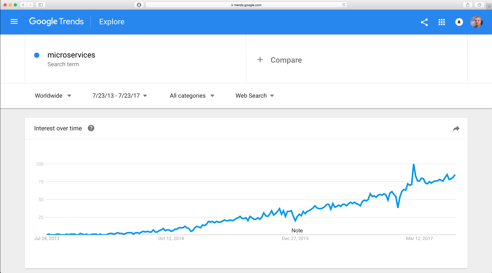

## Geoff Filippi

### Senior Architect

---

# [DISH Network](www.dish.com)

---

# [Oildex](www.oildex.com)

A cloud service company for oil and gas

* 2 years

---

Formerly:

# [Time Warner Cable (Now Charter)](www.timewarnercable.com)

* 12 years

---

## Experience

## DISH Projects

* Microservices
  * Spring Boot
* Continuous Delivery
* Domain Driven Design
* Client Side Components

---

## Experience

## Oildex Projects

* Rewrite 10+-year-old apps
* Angular 2
* Typescript
* Microservices
* NoSQL
  * Mongo

---

## Experience

<i class="fa fa-phone"></i>

* Worked on streaming media (Voice over IP), 6 years
* 5 million phone customers

---

## Experience

<i class="fa fa-video-camera"></i>

* Worked on video and streaming video, 4 years

---

## Projects

[twctv.com](twctv.com)

* Video streaming website
 * backbone.js
* Video streaming Set-Top Box (STB) web application

---
---

# We will cover

* Microservice Architectures
* API Gateways
* NGINX

---

## Microservice Architectures

---

## *Decoupling* is the Primary Benefit of Microservice Architectures

* Development
* Deployment
* Dependencies

---

### Interest Over Time

<a href="img/microservices-interest.png"></a>

---

### Client Challenge

* Keeping track of what to call

---

### Microservice Architecture Before API Gateway

<a href="img/without-api-gateway.svg"></a>

---

### [Interactive - Microservice Architecture Before API Gateway](d3/before.html)

---

## API Gateways

> API Gateways replace *tight coupling* with *loose coupling*

* Help manage large numbers of microservices
* Hide infrastructure complexity from clients

---

### Reverse Proxy

* Handles incoming requests from clients
* Calls a service to get the data to satsify the request
* Returns the data to the client

> An API Gateway is a Reverse Proxy

---

### Microservice Architecture Before API Gateway

<a href="img/without-api-gateway.svg"></a>

---

### [Interactive - Microservice Architecture Before API Gateway](d3/before.html)

---

### Microservice Architecture After API Gateway

<a href="img/with-api-gateway.svg"></a>

---

### [Interactive - Microservice Architecture After API Gateway](d3/after.html)

---

### API Gateway Implementations

#### Open Source

* [NGINX](https://www.nginx.com)
* [Netflix Zuul](https://github.com/Netflix/zuul)
* [Kong](https://getkong.org)
 * Built on NGINX

---

### API Gateway Implementations

#### "Open Source-Based" Enterprise Offering

* [NGINX-plus](https://www.nginx.com/products/)
* [Mashape](https://www.mashape.com)
 * Built on KONG/NGINX

---

### API Gateway Implementations

#### Cloud Services

* [Amazon API Gateway](https://aws.amazon.com/api-gateway/)
* [Google Cloud Platform - Cloud Endpoints](https://cloud.google.com/endpoints/)
* [Azure API Management](https://azure.microsoft.com/en-us/services/api-management/)

---

### API Gateway Implementations

#### Proprietary

* [Apigee](https://apigee.com)
 * Owned by Google
* [MuleSoft](https://www.mulesoft.com/platform/api/manager)
* [Mashery](https://www.mashery.com/api/gateway)
* [CA API Gateway](https://www.ca.com/us/products/ca-api-gateway.html)
* [Oracle API Gateway](https://www.oracle.com/middleware/identity-management/api-gateway/index.html)
* [IBM Bluemix API Gateway](https://console.bluemix.net/docs/openwhisk/openwhisk_apigateway.html#openwhisk_apigateway)
* [3scale by Red Hat](https://www.3scale.net)

---
---

# NGINX

---

## NGINX

* API Gateway
* Load Balancer
* Content Cache
* Web Server

---

## NGINX is Open Source

* [NGINX source code](http://hg.nginx.org/nginx/)
  * [NGINX source code - GitHub mirror](https://github.com/nginx/nginx)
* [Contributing to NGINX](http://nginx.org/en/docs/contributing_changes.html)
* [License](http://nginx.org/LICENSE)

---

## NGINX has a Commercial Offering

* NGINX-plus

> We will not cover the commercial features

---

## [Some Companies That Use NGINX](https://www.nginx.com/resources/wiki/)

* Netflix
* Hulu
* Pinterest
* GitHub
* Heroku
* MaxCDN

---

## NGINX Getting Started

### [Install](https://www.nginx.com/resources/wiki/start/topics/tutorials/install/)

* OS Package
 * Red Hat/CentOS
 * Debian/Ubuntu
 * Win32 Binary
* Build from source

---

## NGINX Getting Started

### [Docker](https://docs.docker.com/samples/nginx/)

---

## NGINX Getting Started

* Mac Homebrew

---

## [NGINX Documentation](http://nginx.org/en/docs/)

---

## NGINX Concepts

* Modules
* Directives
* Contexts
* Events
* Upstreams

---

## NGINX Architecture

* Multiprocess vs. Multithread
 * One master process
 * Multiple worker processes

---

## [Modules](http://nginx.org/en/docs/dirindex.html)

* [ngx_http_proxy_module](http://nginx.org/en/docs/http/ngx_http_proxy_module.html)

---

## [Directives](http://nginx.org/en/docs/dirindex.html)

---

## [Contexts]()

* `main`
* `http`
* `server`
* `upstream`
* `location`
* `mail`

---

## [Variables](http://nginx.org/en/docs/http/ngx_http_core_module.html#variables)

---

## NGINX Configuration

nginx.conf
```
worker_processes  1;

events {
    worker_connections  1024;
}

http {
    include       mime.types;
    default_type  application/octet-stream;

    sendfile        on;
    keepalive_timeout  65;

    server {
        listen       8080;
        server_name  localhost;

        location / {
            root   html;
            index  index.html index.htm;
        }

        error_page   500 502 503 504  /50x.html;
        location = /50x.html {
            root   html;
        }
    }

}
```

---

## NGINX Reverse Proxy Configuration

```
server {
    listen       8080;
    server_name  localhost;

    location /server-a/ {
        proxy_pass http://127.0.0.1:3002; 
    }

    location /server-b/ {
        proxy_pass http://127.0.0.1:3004; 
    }
}
```

---

## [Common NGINX Configuration Mistakes](https://www.nginx.com/resources/wiki/start/topics/tutorials/config_pitfalls/)


---

# Questions?

---

## References

* [NGINX](https://www.nginx.com)
* [NGINX Wiki](https://www.nginx.com/resources/wiki/)
* [NGINX Docker](https://docs.docker.com/samples/nginx/)
* [NGINX source code](http://hg.nginx.org/nginx/)
* [NGINX source code - GitHub mirror](https://github.com/nginx/nginx)
* [Contributing to NGINX](http://nginx.org/en/docs/contributing_changes.html)
* [NGINX - Andrew Alexeev](http://www.aosabook.org/en/nginx.html#fig.nginx.arch)

--

7:15 - 8:15pm - Microservice API Gateways with NGINX - Geoffrey Filippi

(NGINX is pronounced "engine x".) 

Microservices are a popular architectural solution. Clients of microservices may experience some difficulty keeping track of the various instances and endpoints they have to call. An API gateway can help manage large numbers of microservices and hide the infrastructure complexity from your clients. We will review a microservice architecture before and after the addition of an API gateway. 

An API gateway is a reverse proxy. A reverse proxy handles incoming requests from clients and calls a service to get the data to satisfy that request. The reverse proxy returns that data to the client. Many developers write these proxies by hand in custom code, not realizing the are better solutions available. We will mention a number of popular solutions, some open source and some cloud-based services. For this talk, we will focus on NGINX, a popular open source reverse proxy and API Gateway. (NGINX also sells an enterprise offering, NGINX Plus, but this talk will only cover the features available in the open-source version.) 

We will show how to set up NGINX as an API Gateway. We will dive into the configuration and operation of NGINX. 

